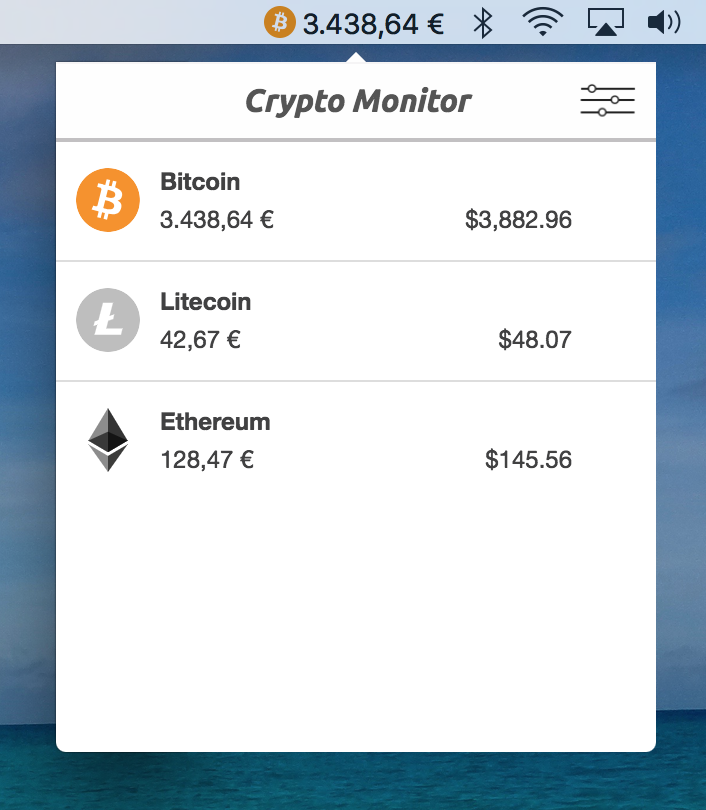

# ₿ Crypto Monitor

The macOS app for hodlers and occasional traders. Always have an eye on your investments and never miss a price again!

- choose between Bitstamp, Bitfinex or Coinbase Pro
- BTC, LTC and ETH to EUR or USD
- realtime updates

Based on Electron and Next.js

# 📋 TODO

- [ ] support macOs dark mode
- [ ] add more sources (Kraken, Binance...)
- [ ] add more languares (Mandarin, Cantonese, Hindi, Arabic, Russian, Japanese, Corean...)
- [ ] support more currency pairs
- [ ] improve UI
- [ ] support Linux and Windows

# dev

yarn start

# prod

yarn dist

# Support

If you like this project and would like to encourage the creator, you can contribute with a small donation.

